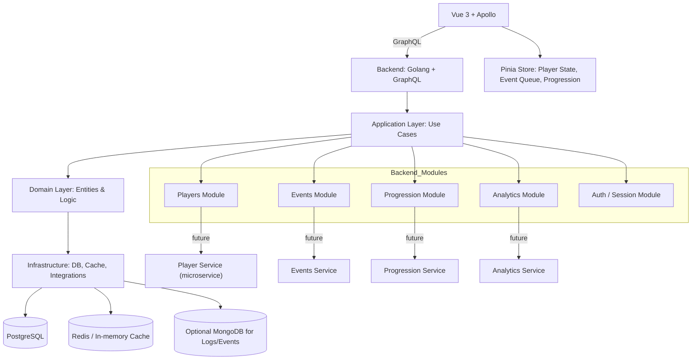

# Архитектура приложения MVP — Narrative Survival Game «Армейка»



---

## Краткое описание модулей

### 1. Frontend (Vue 3 + Apollo)

* Отвечает за рендер UI, выбор игрока, отображение прогрессии и статистики.
* Apollo обеспечивает GraphQL-связь с backend.
* Pinia хранит локальное состояние игрока (параметры, очередь событий, текущие выборы).

### 2. Backend (Golang + GraphQL)

**Структура проекта:**

```
cmd/
  server/
    main.go              # Точка входа приложения
internal/
  app/                  # Application Layer
    handlers/            # GraphQL resolvers
    middleware/         # Middleware (logging, auth, cors)
    services/            # Use cases
  domain/               # Domain Layer
    entities/            # Сущности (Player, Event, etc.)
    services/            # Бизнес-логика (GameLogic, EventGenerator)
    repositories/        # Интерфейсы репозиториев
  infrastructure/        # Infrastructure Layer
    database/            # PostgreSQL connection, migrations
    cache/               # Redis implementation
    repositories/        # Реализация репозиториев
    config/              # Configuration management
pkg/                    # Public API
  graphql/              # GraphQL schema definitions
  models/               # Shared models/types
  errors/               # Custom error types
```

**Слои:**

* **Application Layer** (`internal/app/`): GraphQL resolvers, middleware, use cases
* **Domain Layer** (`internal/domain/`): бизнес-логика, сущности, интерфейсы
* **Infrastructure Layer** (`internal/infrastructure/`): БД, кеши, внешние зависимости

**Технологический стек:**

* **GraphQL**: `gqlgen` для code-first подхода
* **База данных**: PostgreSQL + `pgx` драйвер
* **ORM**: `sqlc` для type-safe SQL или `ent` для ORM
* **Кеширование**: Redis + `go-redis`
* **Конфигурация**: `viper`
* **Логирование**: `zap` или `logrus`
* **Валидация**: `go-playground/validator`
* **Тестирование**: встроенный `testing` + `testify`

**Модули (по пакетам):**

* **Players Module** (`internal/domain/services/player.go`): управление игроками, параметрами, сохранение состояния.
* **Events Module** (`internal/domain/services/event.go`): генерация, хранение и обработка событий; шаблоны событий.
* **Progression Module** (`internal/domain/services/progression.go`): рост формального и неформального статуса, вычисление финалов.
* **Analytics Module** (`internal/domain/services/analytics.go`): сбор данных для баланса и аналитики.
* **Auth / Session Module** (`internal/app/middleware/auth.go`): JWT токены, управление сессиями.

### 3. Базы данных

* PostgreSQL: основное хранилище игроков, прогрессии и событий.
* Redis / In-memory Cache: кеширование часто запрашиваемых данных (очередь событий, временные состояния).
* MongoDB (опционально): хранение логов, историй событий и аналитики для будущих версий.

### 4. Микросервисы (будущее)

* Все backend-модули структурированы так, чтобы их можно было вынести в отдельные сервисы при росте нагрузки.

### 5. CI/CD и DevOps

* Docker: контейнеризация backend + frontend.
* CI/CD: сборка, тесты, деплой.
* Тесты: unit-тесты для генерации событий и проверок, E2E-тесты для сценариев игры.

### 6. Golang-specific особенности

**Конкурентность:**

* Использование goroutines для фоновых задач (генерация событий, очистка кеша)
* Channels для коммуникации между сервисами
* Context для управления временем жизни запросов

**Обработка ошибок:**

* Explicit error handling с кастомными типами ошибок
* Error wrapping с `%w` для сохранения контекста
* Централизованная обработка ошибок в middleware

**Dependency Injection:**

* Использование интерфейсов для loose coupling
* Constructor-based dependency injection
* Wire (Google) для автоматической сборки зависимостей (опционально)

**Производительность:**

* Connection pooling для PostgreSQL
* Efficient JSON marshaling/unmarshaling
* Memory pooling для частых аллокаций

---

Эта архитектура позволяет:

1. Быстро разрабатывать MVP в виде монолита.
2. Легко масштабироваться в будущем с переходом на микросервисы.
3. Чётко разделять бизнес-логику, инфраструктуру и пользовательский интерфейс.
4. Поддерживать расширяемость системы событий, прогрессии и аналитики.
